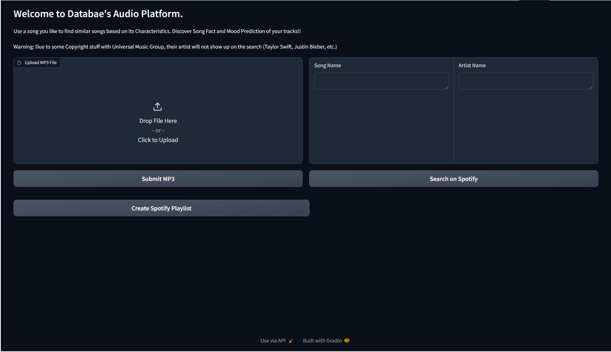

<p align="center">
  
</p>
<p align="center">
    <h1 align="center">dataBAEs - Music Recommendation App</h1>
</p>
<p align="center">
    <em>dataBAEs user interface - Hosted by HuggingFace </em>
</p>
<p align="center">
  
</p>
<p align="center">
    <em>Link to the application: <a href="https://huggingface.co/spaces/bachkhoa144/dataBAEs_musicapp">dataBAEs' Audio Platform</a></em>
</p>
<p align="center">
		<em>Developed with the software and tools below.</em>
</p>
<p align="center">
	
	
	
	
	
	
</p>
<hr>

##  Quick Links

> - [ Overview](#-overview)
> - [ Features](#-features)
> - [ Repository Structure](#-repository-structure)
> - [ Modules](#-modules)
> - [ Getting Started](#-getting-started)
>   - [ Installation](#-installation)
>   - [ Running dataBAEs_musicapp](#-running-dataBAEs_musicapp)
>   - [ Tests](#-tests)
> - [ Project Roadmap](#-project-roadmap)
> - [ Contributing](#-contributing)
> - [ License](#-license)
> - [ Acknowledgments](#-acknowledgments)

---

##  Overview

The dataBAEs_Harmonica initiative delivers a music platform that harnesses advanced technology to improve the user experience. Employing audio embeddings and machine learning, the application features capabilities including mood prediction, finding akin tracks, and summarizing songs. It integrates with platforms such as Spotify and OpenAI to allow users to discover music interactively, including uncovering similar tunes and producing intriguing trivia about them. The project adeptly manages data using S3 for uploads and downloads, along with interactions with AstraDB, to ensure efficient scalability and robust performance. In essence, dataBAEs_musicapp presents a distinctive and creative method for exploring and enjoying music.

<p align="right">(<a href="#readme-top">back to top</a>)</p>

---

##  Features

### Integrations
The dataBAEs_musicapp is engineered to integrate smoothly with a variety of services. It leverages **AstraDB** and **OpenAI** for enriched data interactions and content generation. For music data, **Spotify** is a central resource, providing a comprehensive library for user queries. The application's interface is powered by **Gradio**, facilitating an engaging and interactive user experience.

### Dependencies
Essential to the functionality of the application are its dependencies, which include:
- **Requests**: For streamlined HTTP sessions.
- **Gradio**: To create interactive UI elements.
- **boto3**: For AWS services interaction, particularly S3.
- **astrapy**: For interacting with DataStax, particularly Astra DB.
- **openai**: For making API call to ChatGPT model, GPT-3.5 Turbo
- **towhee**: For leveraging pre-trained model for audio embedding
- **pandas**: For efficient data structuring and analysis.
- **TensorFlow** and **numpy**: These libraries are foundational for executing machine learning models and numerical computations within the app.

### Scalability
Scalability is a cornerstone of the dataBAEs_musicapp, with **Amazon S3** providing a robust and scalable data storage solution. The application is optimized for concurrent song preview downloads, a feature critical for scalability. 

However, anybody can have the option to store mp3 file in other places based on their needs and can run open-source vector database locally without using Data Stax. The main storage and vector database option is flexible in this project. You just need to figure it out what you wants and what will work best for you based on that demand. 


<p align="right">(<a href="#readme-top">back to top</a>)</p>

---

##  Repository Structure

```sh
└── dataBAEs_musicapp/
    ├── README.md
    ├── app.py
    ├── config.py
    ├── data
    │   └── NN_mood_prediction_feature.h5
    ├── data_extraction
    │   ├── MachineLearning_Model.ipynb
    │   ├── audio_embedding.py
    │   └── spotify
    │       ├── step_1_retrieve_album_ids.py
    │       ├── step_2_retrieve_track_ids.py
    │       └── step_3_download_tracks.py
    ├── data_load
    │   ├── S3
    │   │   ├── loadData_to_S3.py
    │   │   └── retrieveData_from_s3.py
    │   └── datastax
    │       └── upload_to_datastax.py
    ├── q
    ├── requirements.txt
    └── user_features
        ├── mood_classification.py
        ├── similarity_search.py
        ├── song_summarization.py
        └── spotify_service.py
```
<p align="right">(<a href="#readme-top">back to top</a>)</p>

---

##  Modules

<details closed><summary>.</summary>

| File                                                                                        | Summary                                                                                                                                                                                                   |
| ---                                                                                         | ---                                                                                                                                                                                                       |
| [config.py](https://github.com/khoa9/dataBAEs_musicapp/blob/master/config.py)               | Code snippet in `config.py` manages configurations for external services like AstraDB, OpenAI, and Spotify. It provides keys and tokens for seamless integration within dataBAEs_musicapp's architecture. |                                                                  |
| [requirements.txt](https://github.com/khoa9/dataBAEs_musicapp/blob/master/requirements.txt) | Code snippet in `data_load/loadData_to_S3.py` uploads data to S3 for scalable storage in the dataBAEs_musicapp repository, an essential step in managing large volumes of information efficiently.        |
| [app.py](https://github.com/khoa9/dataBAEs_musicapp/blob/master/app.py)                     | app.py` utilizes audio embedding to find similar songs using Gradio for user interface, leveraging parent repo's ML models and service for music app features.                                            |

</details>

<details closed><summary>data_extraction</summary>

| File                                                                                                                              | Summary                                                                                                                                                                |
| ---                                                                                                                               | ---                                                                                                                                                                    |
| [audio_embedding.py](https://github.com/khoa9/dataBAEs_musicapp/blob/master/data_extraction/audio_embedding.py)                   | Code in `audio_embedding.py` in `data_extraction` extracts audio features for the music app's ML model.|
| [MachineLearning_Model.ipynb](https://github.com/khoa9/dataBAEs_musicapp/blob/master/data_extraction/MachineLearning_Model.ipynb) | This notebook is used to trained the NN model that will be used in feature 2 when presenting results to the users. Used Data in this notebook is the metadata and vector data (after being processed) |

</details>

<details closed><summary>data_extraction.spotify</summary>

| File                                                                                                                                        | Summary                                                                                                                                                                                                      |
| ---                                                                                                                                         | ---                                                                                                                                                                                                          |
| [step_1_retrieve_album_ids.py](https://github.com/khoa9/dataBAEs_musicapp/blob/master/data_extraction/spotify/step_1_retrieve_album_ids.py) | This code snippet scrapes Album IDs from Rateyourmusic HTML dumps to obtain album IDs. It facilitates web scraping for music app feature extraction.                     |
| [step_2_retrieve_track_ids.py](https://github.com/khoa9/dataBAEs_musicapp/blob/master/data_extraction/spotify/step_2_retrieve_track_ids.py) | The code snippet retrieves track IDs from scrapped AlbumIDs, retaining those with Preview URLs. It plays a critical role in the data extraction process within the music app repository.                     |
| [step_3_download_tracks.py](https://github.com/khoa9/dataBAEs_musicapp/blob/master/data_extraction/spotify/step_3_download_tracks.py)       | This code downloads song previews based on track IDs and metadata (genres, moods, artist name,etc.) in parallel. It enhances the music app by efficiently fetching and organizing audio samples. |

</details>

<details closed><summary>user_features</summary>

| File                                                                                                                  | Summary                                                                                                                                                                                                                                                                 |
| ---                                                                                                                   | ---                                                                                                                                                                                                                                                                     |
| [spotify_service.py](https://github.com/khoa9/dataBAEs_musicapp/blob/master/user_features/spotify_service.py)         | Code snippet in `spotify_service.py` retrieves Spotify track preview URLs using Spotify API credentials stored in config. Integrates with the parent repository's user_features module for music app functionality.                                                       |
| [similarity_search.py](https://github.com/khoa9/dataBAEs_musicapp/blob/master/user_features/similarity_search.py)     | Code in `similarity_search.py` conducts similarity search in AstraDB. It utilizes song vectors to find similar songs from the collection, returning a DataFrame with details. The code supports music recommendation features in the parent dataBAEs_musicapp repository. |
| [song_summarization.py](https://github.com/khoa9/dataBAEs_musicapp/blob/master/user_features/song_summarization.py)   | Code in `song_summarization.py`, utilizes OpenAI API to generate fun facts about songs based on user queries. Enhances user experience by providing engaging and amusing insights into music content on the recommendation platform.                          |
| [mood_classification.py](https://github.com/khoa9/dataBAEs_musicapp/blob/master/user_features/mood_classification.py) | Code in `mood_classification.py` predicts music characteristics using a loaded model. It maps features to mood labels for classification within the music app architecture.                                                                                             |

</details>

<details closed><summary>data_load.S3</summary>

| File                                                                                                                   | Summary                                                                                                                                                                                                                                                                              |
| ---                                                                                                                    | ---                                                                                                                                                                                                                                                                                  |
| [loadData_to_S3.py](https://github.com/khoa9/dataBAEs_musicapp/blob/master/data_load/S3/loadData_to_S3.py)             | This code snippet uploads files from a local directory to an S3 bucket in parallel. It leverages concurrent processing for efficient uploads, enhancing the data load component of the music app repository architecture.                                               |
| [retrieveData_from_s3.py](https://github.com/khoa9/dataBAEs_musicapp/blob/master/data_load/S3/retrieveData_from_s3.py) | This code uses AWS S3 to download files concurrently, ensuring efficient retrieval. Key features include parallel file downloads and handling exceptions. This module seamlessly integrates with the repository's data loading processes. |

</details>

<details closed><summary>data_load.datastax</summary>

| File                                                                                                                     | Summary                                                                                                                                                                                                                                                               |
| ---                                                                                                                      | ---                                                                                                                                                                                                                                                                   |
| [upload_to_datastax.py](https://github.com/khoa9/dataBAEs_musicapp/blob/master/data_load/datastax/upload_to_datastax.py) | This code initializes AstraDB client, creates a music collection, inserts & retrieves music vectors for similarity search. This file manages interactions with the datastax database for music-related features. |

</details>

<p align="right">(<a href="#readme-top">back to top</a>)</p>

---

## Config Requirement

Before you can run the dataBAEs_musicapp project, there are several credentials and accounts you need to have set up:

1. **AWS Account**: You will need an AWS account with the following:
   - `AWS Access Key`: Your AWS access key ID.
   - `AWS Secret Key`: Your AWS secret access key.
   
   These credentials are necessary for accessing and interacting with AWS services, including S3 for data storage.

2. **DataStax Account**: To interact with Astra DB, you will require:
   - `Token`: Your authentication token for Astra DB.
   - `API Endpoint`: The endpoint URL for accessing your Astra DB instance.
   
   This will allow you to store and retrieve the vectorized form of audio data in the database.

3. **Spotify API**: To fetch data from Spotify, you'll need:
   - `User-Token`: Token that represents the user's authorization to access their Spotify data.
   - `Client_ID`: Your Spotify application's client ID.
   - `Client_Secret`: Your Spotify application's client secret.
   
   These are utilized to authenticate and retrieve song previews and metadata from the Spotify Web API.

4. **OpenAI Key**: For generating song histories and fun facts, an OpenAI API key is required.

<p align="right">(<a href="#readme-top">back to top</a>)</p>

---

## Tech Stack Options
Please feel free to choose other tech options based on your needs:
- **Datalake Storage:** many options like Azure, GCP, etc. instead of AWS
- **Vector Database:**
    
    + Cloud: MongoDB Atlas, MariaDB, Couchbase, AWS, Azure, GCP, etc.

    + Open-source: ChromaDB, Milvus, Pinecone, Weaviate, etc.
- **LLM's integration:** LlamMa (2 or 3),  Claude, BERT, etc.

---

##  Getting Started

***Requirements***

Ensure you have the following dependencies installed on your system:

* **Python**: `version 3.11.8`

###  Installation

1. Clone the dataBAEs_musicapp repository:

```sh
git clone https://github.com/khoa9/dataBAEs_musicapp
```

2. Change to the project directory:

```sh
cd dataBAEs_musicapp
```

3. Install the dependencies:

```sh
pip install -r requirements.txt
```

### Important Note

**Ensure that the backend setup, including all data processing and storage in Astra DB, is fully completed before running `app.py`.**

The link provided at the beginning of this note is ran by using our team's credentials on different services (S3, DataStax, Spotify, OpenAI). Thus, if you want to run everything from scratch and build your own application, you need to configure all of the config requirement and build the backend before running app.py

**Backend process:** (I will update this one with the completed pipeline file soon)

Inside the `data extraction` & `data load` folder, you'll find scripts designed for the following purposes:

- **Extracting Data from Spotify API**: These scripts use your Spotify API credentials to pull song data, including audio previews and metadata.

- **Processing and Storing Data on AWS S3**: After extraction, the data is processed and loaded onto AWS S3. This involves initial data structuring and storage in preparation for further processing.

- **Data Processing for Astra DB**: A subsequent process retrieves the data from S3, cleans it to extract the required metadata, and uses function in `audio_embedding.py` to convert the audio data into a vector format.

- **Storing Processed Data in Astra DB**: Finally, the cleaned and processed data is stored in Astra DB in its vector form, ready for retrieval and use by the backend services.

Once the data is securely stored in Astra DB, the backend system is ready for use, with all necessary data in place to provide music recommendations.


###  Running dataBAEs_musicapp

Use the following command to run dataBAEs_musicapp:

```sh
python app.py
```

<p align="right">(<a href="#readme-top">back to top</a>)</p>

---

##  Contributing

Contributions are welcome! Here are several ways you can contribute:

- **[Join the Discussions](https://github.com/khoa9/dataBAEs_musicapp/discussions)**: Share your insights, provide feedback, or ask questions to my email: khoatrann1998@gmail.com
- **[Report Issues](https://github.com/khoa9/dataBAEs_musicapp/issues)**: Submit bugs found or log feature requests for Databaes_musicapp.

Please feel free to send me email regarding contributions for this project

<p align="right">(<a href="#readme-top">back to top</a>)</p>

---


## Final thoughts

As this project concludes, I invite everyone—from students to seasoned technologists—to use this resource for learning and exploration. Despite its academic roots, this project offers a robust introduction to vector databases and audio embeddings. Feel free to dive in, tweak, and expand upon what's here to suit your educational and research needs.

Your Contribution Matters: I encourage you to adapt and enhance dataBAEs, making it a base for your innovations. Share your progress and findings; your contributions can inspire and elevate the entire community.

<p align="right">(<a href="#readme-top">back to top</a>)</p>

---

## HAPPY LEARNING !!!
